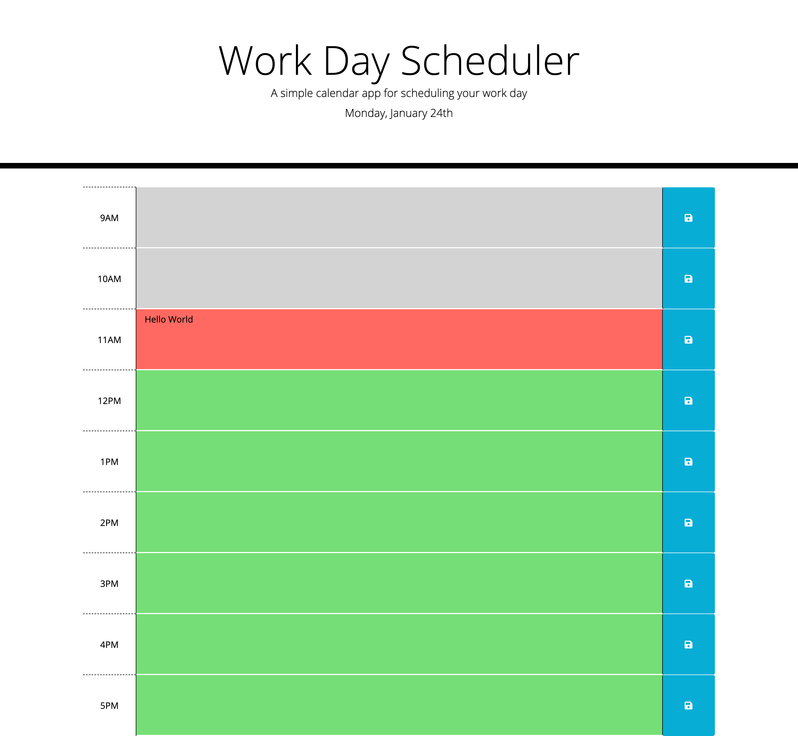

# "Work Day Scheduler" project

## Purpose
Work Day Scheduling application, can be used to store tasks by hour (9AM - 5PM)

## Built with
* HTML
* CSS
* Bootstrap
* JavaScript
* jQuery
* momentJS

## Website
https://tokhalyan.github.io/work-day-scheduler/

## Important Notes
* The application is getting live day data with moment JS
* The user can store tasks in specified area
* All saved tasks will be stored in the local storage
* Depending on the time the tasks will change their background colors. 
    - Past time - Grey
    - Current time - Red
    - Future time - Green 
* The page has responsive design

## Contribution

 Made with ❤ by Shahen Tokhalyan

 